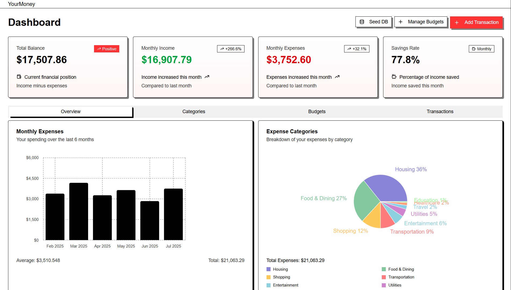

# 💰 Finance Visualizer



A comprehensive personal finance management application built with Next.js that helps you track, analyze, and visualize your financial data with beautiful charts and insights.

## ✨ Features

### 📊 Dashboard Overview

- **Real-time Financial Summary**: Track total balance, monthly income, expenses, and savings rate
- **Monthly Trends**: Visualize spending patterns over the last 6 months
- **Category Breakdown**: Interactive pie charts for income and expense categories
- **Smart Insights**: AI-powered spending analysis and budget alerts

### 💸 Transaction Management

- **Add Transactions**: Quick and easy transaction entry with categorization
- **Edit & Delete**: Full CRUD operations for transaction management
- **Advanced Filtering**: Filter by type, category, date range, and description
- **Data Export**: Export transaction data for external analysis

### 📈 Budget Management

- **Set Budgets**: Create monthly and yearly budgets for different expense categories
- **Budget Tracking**: Visual progress bars showing budget utilization
- **Overspending Alerts**: Automatic warnings when approaching or exceeding budget limits
- **Budget vs Actual**: Comparative charts showing planned vs actual spending

### 🔍 Financial Insights

- **Spending Patterns**: Identify top spending categories and trends
- **Daily Averages**: Track daily spending and project monthly totals
- **Budget Performance**: Detailed breakdown of budget adherence
- **High Expense Alerts**: Highlight unusual or large transactions

### 📱 Modern UI/UX

- **Responsive Design**: Works seamlessly on desktop, tablet, and mobile
- **Dark/Light Mode**: Toggle between themes for comfortable viewing
- **Interactive Charts**: Powered by Recharts for beautiful data visualization
- **Intuitive Navigation**: Clean, modern interface with easy-to-use controls

## 🚀 Getting Started

### Prerequisites

- Node.js 18+
- MongoDB database (local or cloud)
- npm, yarn, or pnpm

### Installation

1. **Clone the repository**

   ```bash
   git clone https://github.com/Pratham-595/Finance_Visualiser
   cd finance-visualizer
   ```

2. **Install dependencies**

   ```bash
   npm install
   # or
   yarn install
   # or
   pnpm install
   ```

3. **Set up environment variables**
   Create a `.env.local` file in the root directory:

   ```env
   MONGODB_URI=your_mongodb_connection_string
   ```

4. **Run the development server**

   ```bash
   npm run dev
   # or
   yarn dev
   # or
   pnpm dev
   ```

5. **Open your browser**
   Navigate to [http://localhost:3000](http://localhost:3000)

### 🎯 Quick Start with Sample Data

The application includes a database seeding feature to help you get started quickly:

1. Click the "Seed DB" button in the dashboard
2. This will populate your database with sample transactions and budgets
3. Explore the various features with realistic financial data

## 🛠️ Technology Stack

### Frontend

- **Next.js 15** - React framework with App Router
- **TypeScript** - Type-safe development
- **Tailwind CSS** - Utility-first CSS framework
- **Radix UI** - Accessible component primitives
- **Recharts** - Composable charting library
- **React Hook Form** - Performant forms with validation
- **Zod** - TypeScript-first schema validation

### Backend

- **Next.js API Routes** - Serverless API endpoints
- **MongoDB** - NoSQL database for data storage
- **Mongoose** - MongoDB object modeling for Node.js

### UI Components

- **Shadcn/ui** - Beautiful, accessible components
- **Tabler Icons** - Comprehensive icon library
- **Sonner** - Beautiful toast notifications
- **Date-fns** - Modern date utility library

## 📁 Project Structure

```
finance-visualizer/
├── src/
│   ├── app/                    # Next.js app directory
│   │   ├── api/               # API routes
│   │   ├── dashboard/         # Dashboard page
│   │   └── layout.tsx         # Root layout
│   ├── components/            # Reusable components
│   │   ├── ui/               # Base UI components
│   │   ├── section-cards.tsx  # Dashboard summary cards
│   │   ├── transactions-table.tsx # Transaction management
│   │   ├── budget-comparison-chart.tsx # Budget analysis
│   │   └── ...               # Other feature components
│   ├── lib/                   # Utility functions and configurations
│   │   ├── types.ts          # TypeScript types and schemas
│   │   ├── models.ts         # MongoDB models
│   │   └── db.ts             # Database connection
│   └── hooks/                 # Custom React hooks
└── ...
```

## 🔧 Configuration

### Environment Variables

- `MONGODB_URI`: MongoDB connection string (required)

### Database Schema

The application uses two main collections:

- **Transactions**: Store income and expense records
- **Budgets**: Store budget limits for expense categories

## 🎨 Customization

### Adding New Categories

1. Update the `TransactionCategory` enum in `src/lib/types.ts`
2. Add display names in `CategoryDisplayNames`
3. Update the `getCategoriesByType` function

### Styling

- Modify `tailwind.config.js` for theme customization
- Update CSS variables in `src/app/globals.css`
- Customize component styles in respective component files
